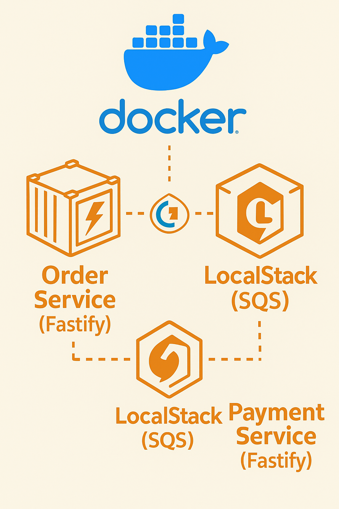
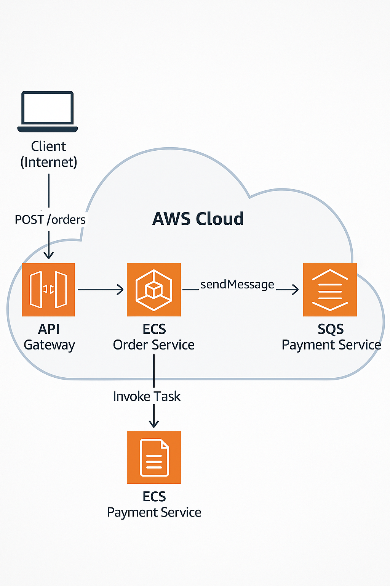

# Microservices Async POC

Este repositório demonstra um **proof of concept** (POC) de comunicação assíncrona entre dois microsserviços: **Order Service** (produtor) e **Payment Service** (consumidor), utilizando **AWS SQS** simulado localmente via **LocalStack**, orquestrado por **Docker Compose**, e documentado via **Swagger/OpenAPI**.

---

## 📚 Conceitos-Chave

### Microsserviços
- Cada serviço faz uma única tarefa: criação de pedidos vs processamento de pagamento.  
- Desacoplados e independentes, comunicando-se apenas por meio de filas.  
- Escaláveis e resilientes: falhas temporárias não afetam o ecossistema.

### Comunicação Assíncrona com SQS
- **Producer (Order Service)** publica eventos (`sendMessage`) em uma fila.  
- **Queue (SQS)** atua como buffer durável, garantindo entrega e ordenação eventual.  
- **Consumer (Payment Service)** consome mensagens (`receiveMessage` + `deleteMessage`) em loop contínuo.  
- Long polling (`WaitTimeSeconds`) reduz chamadas ociosas.  
- Visibility timeout evita processar a mesma mensagem em mais de uma instância.

### LocalStack
- Emula serviços AWS (SQS) em containers Docker, sem requerer credenciais reais.  
- `awslocal` simplifica o uso de CLI dentro do container.

### Docker & Docker Compose
- **Multi-stage builds** (builder + runtime) para imagens enxutas.  
- `env_file` injeta variáveis de ambiente sem copiar `.env` para a imagem.  
- Volumes e hot-reload no modo de desenvolvimento.

### Fastify & TypeScript
- **Fastify**: framework HTTP de alta performance.  
- **TypeScript**: tipagem estática, maior robustez.  
- **dotenv**: configuração via arquivo `.env`.  
- **Swagger/OpenAPI**: documentação interativa automática em `/docs`.

---
## 📁 Arquitetura local

<p align="center">
  
</p>

## 📁 Arquitetura ambiente cloud

<p align="center">
  
</p>

## 📁 Estrutura do Projeto

```text
MICROSERVICES-ASYNC/
├── .gitignore
├── README.mdx
├── docker-compose.yml
│
├── order-service/
│   ├── .env.example
│   ├── Dockerfile
│   ├── package.json
│   ├── tsconfig.json
│   └── src/
│       ├── server.ts         # Fastify + Swagger + rota POST /orders
│       └── orderPublisher.ts # Configuração AWS.SQS + sendMessage
│
└── payment-service/
    ├── .env.example
    ├── Dockerfile
    ├── package.json
    ├── tsconfig.json
    └── src/
        └── consumer.ts       # Loop de receiveMessage + processamento + deleteMessage
```

---

## 🛠️ Pré-requisitos

- **Docker** (>=20.x)  
- **Docker Compose** (>=1.29.x)  
- Opcional: **AWS CLI** (se quiser usar localmente mas `awslocal` é suficiente)

---

## 🚀 Executando em Modo Desenvolvimento (Hot-Reload)

1. **Clone** o repositório:
   ```bash
   git clone https://github.com/seu-usuario/microservices-async.git
   cd microservices-async
   ```

2. **Suba** LocalStack, Order e Payment em containers com volumes:
   ```bash
   docker-compose up --build
   ```

3. **Crie** a fila `orders`:
   ```bash
   docker-compose exec localstack awslocal sqs create-queue --queue-name orders
   ```

4. **Teste** a API Order Service:
   - Swagger UI: [http://localhost:3001/docs](http://localhost:3001/docs)  
   - Curl:
     ```bash
     curl -X POST http://localhost:3001/orders \
       -H "Content-Type: application/json" \
       -d '{"userId":"dev-user","total":42.00}'
     ```

5. **Observe** logs do Payment Service para ver o processamento:
   ```bash
   docker-compose logs -f payment-service
   ```

---

## 📦 Executando em Produção (Imagem Enxuta)

Caso queira gerar imagens de produção:

1. Ajuste `order-service/Dockerfile` e `payment-service/Dockerfile` para multi-stage build.  
2. Suba sem volumes:
   ```bash
   docker-compose up --build
   ```
3. Crie a fila como antes e teste.

---

## 💡 Próximos Passos / Melhoria

- Healthcheck + `depends_on: condition: service_healthy` para LocalStack.  
- Init script para criar filas automaticamente.  
- Uso de **Dead-Letter Queue** (DLQ) para mensagens falhadas.  
- Migração para AWS SDK v3 (`@aws-sdk/client-sqs`).  
- Adicionar banco de dados (PostgreSQL/DynamoDB) para persistência e idempotência.  
- Métricas e dashboards (Prometheus / Grafana).

---

### Licença

Este projeto é um POC de demonstração e está licenciado sob MIT.

